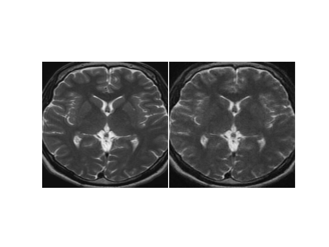

## Example Outputs

### Diffusion Training Visualization
 


 

### Anomaly Detection Results


### Simplex Noise Example


---

## Project Structure

```plaintext
Annotsim/
├── src/
│   ├── models/               # Model architectures (UNet, Transformer blocks, etc.)
│   ├── utils/                # Helper functions (dataset loading, noise generation, etc.)
│   ├── scripts/              # Training and evaluation scripts
├── assets/                   # Visual assets and results
├── requirements.txt          # Python dependencies
├── setup.py                  # Installation script
├── README.md                 # Project documentation
└── .gitignore                # Ignored files and directories

Installation

Prerequisites
	•	Python 3.8 or later
	•	CUDA-enabled GPU (optional but recommended for training)

Steps
	1.	Clone the repository:

git clone https://github.com/MAXNORM8650/Annotsim.git
cd Annotsim


	2.	Create a virtual environment (optional but recommended):

python -m venv venv
source venv/bin/activate  # On Windows: venv\Scripts\activate


	3.	Install dependencies:

pip install -r requirements.txt


	4.	Install the repository as a package:

pip install -e .

Usage

Train a Diffusion Model

To train a diffusion model:

python src/scripts/diffusion_training_UVW.py --config path/to/config.yaml

Replace path/to/config.yaml with your desired configuration file from the test_args directory.

Evaluate a Model

To evaluate a model:

python src/scripts/detection.py --config path/to/config.yaml

Datasets

This project utilizes two publicly available datasets:
	1.	BRATS2021: A dataset for brain tumor segmentation.
	2.	Pneumonia X-Ray: A dataset for chest X-ray anomaly detection.

For more details, refer to the datasets’ official documentation:
	•	BRATS2021
	•	Pneumonia X-Ray

Results

Diffusion Videos

Generated videos during training and evaluation are saved in:

outputs/diffusion-videos/

Detection Outputs

Detection results are saved in:

outputs/detection-images/

Citation

If you use this work in your research, please cite the following paper:

@inproceedings{kumar2024annotsim,
  title={Self-Supervised Anomaly Segmentation via Diffusion Models with Dynamic Transformer UNet},
  author={Kumar, Komal and Chakraborty, Snehashis and Roy, Sudipta},
  booktitle={Proceedings of the IEEE/CVF Winter Conference on Applications of Computer Vision (WACV)},
  pages={XXXX--XXXX},
  year={2024},
  organization={IEEE}
}

Contributors
	•	Komal Kumar: GitHub Profile

The project incorporates code and concepts from:
	•	AnoDDPM
	•	Predictive Convolutional Attentive Block
	•	Guided Diffusion

License

This project is licensed under the MIT License.

Acknowledgments

We would like to thank the open-source community for providing valuable resources and tools that made this project possible.

Getting Started

For a quick start, refer to the Installation and Usage sections above. If you encounter any issues or have questions, feel free to open an issue on the GitHub repository.

Contact

For any inquiries or collaborations, please contact Komal Kumar at komal.kumar@example.com.

Roadmap

Future updates will include:
	•	Integration with more diverse datasets.
	•	Enhanced visualization tools.
	•	Support for real-time anomaly detection.

Stay tuned!

Contributing

Contributions are welcome! Please read the CONTRIBUTING.md for guidelines on how to proceed.

FAQ

Q1: What is the main advantage of using DTUNet over traditional UNet architectures?

A1: DTUNet leverages dynamic transformer blocks to handle time and noise image patches as tokens, enhancing the model’s ability to segment anomalies more accurately, especially in complex and high-dimensional data.

Q2: How can I customize the simplex noise function?

A2: You can modify the simplex noise parameters in the utils/noise_generation.py file. Refer to the documentation for detailed instructions.

Feel free to explore and contribute to Annotsim!

---

**Notes:**

- Ensure that all asset paths (e.g., images and plots) are correctly placed in the `assets/` directory as specified in the project structure.
- Replace placeholder values in the citation (e.g., `pages={XXXX--XXXX}`) with the actual page numbers once the paper is published.
- Update the contact email (`komal.kumar@example.com`) with the actual email address.
- Make sure to include a `LICENSE` file in the repository to specify the MIT License terms.
- Create a `CONTRIBUTING.md` file to guide contributors on how to contribute to the project.

This README provides a comprehensive overview of the Annotsim project, including its features, installation instructions, usage examples, and contribution guidelines. It is structured to help users and potential contributors understand and engage with the project effectively.
