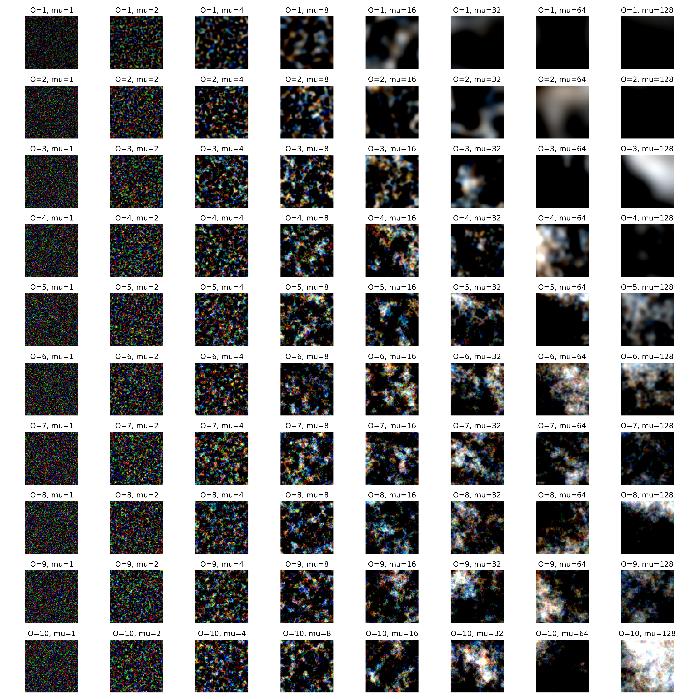
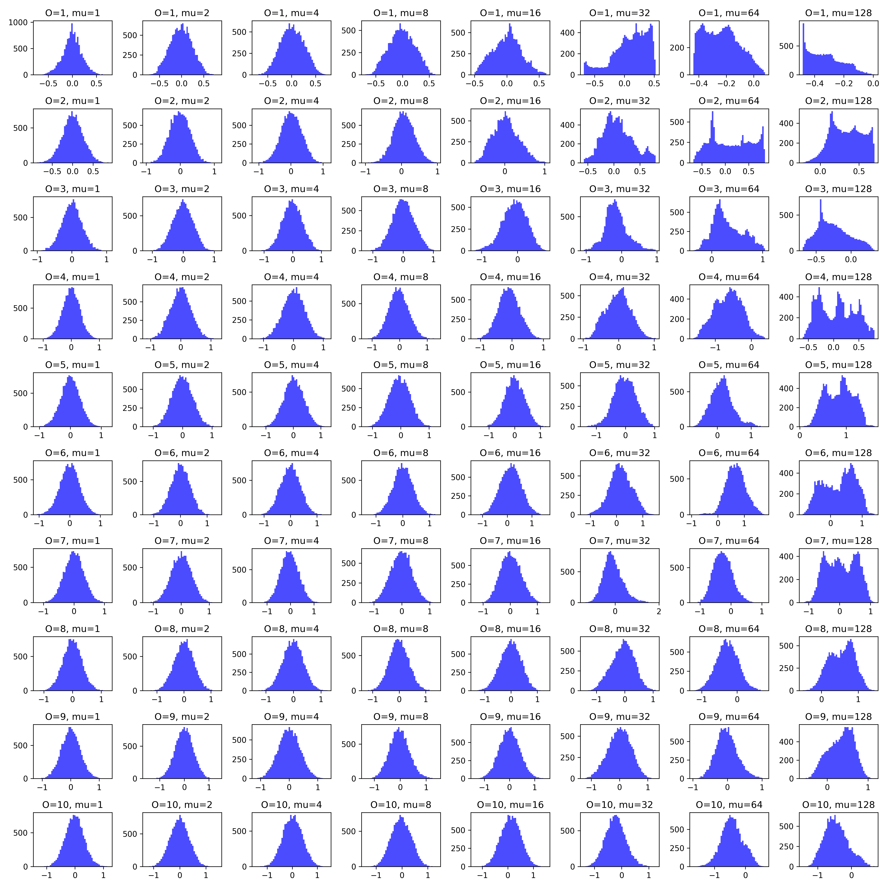
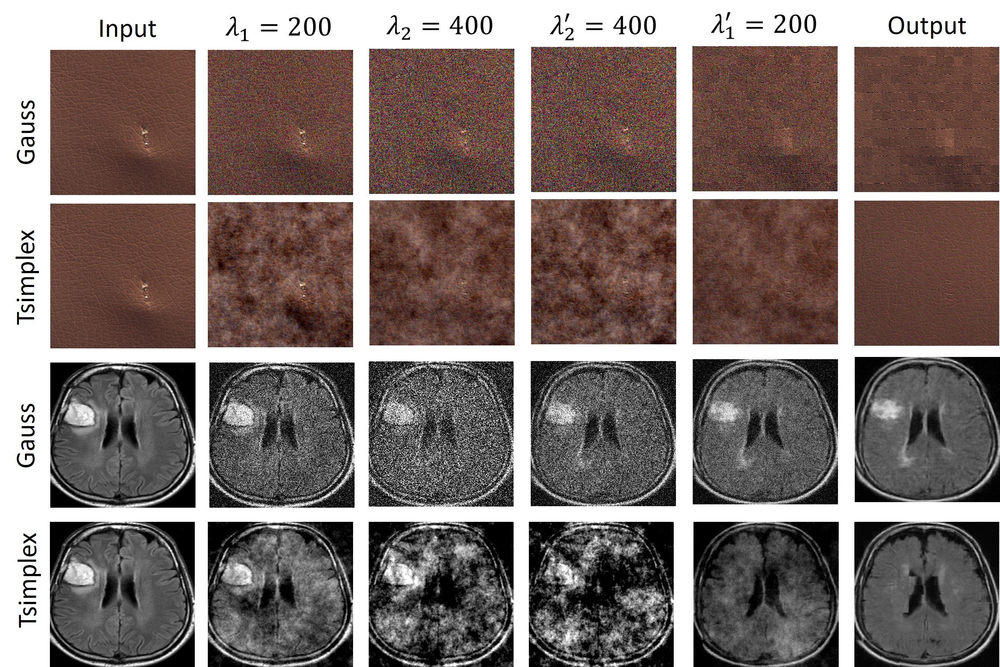
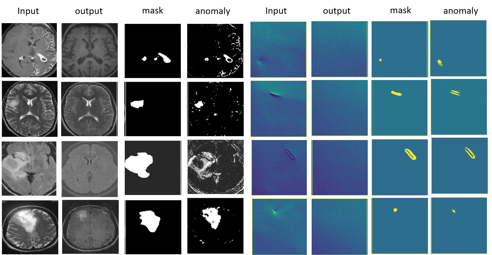
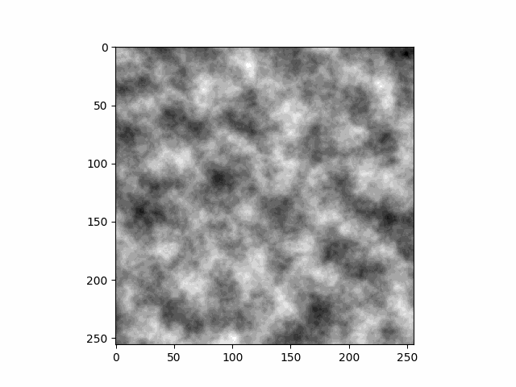
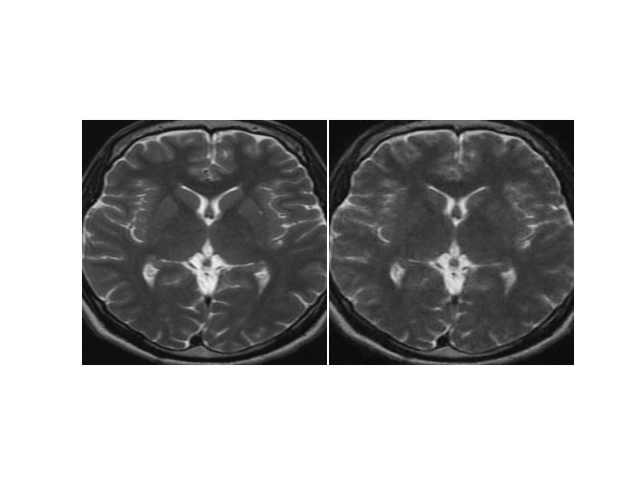

---

# Annotsim: Self-Supervised Anomaly Segmentation via Diffusion Models with Dynamic Transformer UNet (WACV 2024) 🚀
This research paper introduces a novel self-supervised anomaly detection method for image segmentation. It employs a diffusion model utilising a newly developed four-dimensional simplex noise function (Tsimplex) for improved efficiency and sample quality, especially in higher-dimensional and coloured images. The core of the model is a Dynamic Transformer UNet (DTUNet), a modified Vision Transformer architecture designed to handle time and noise image patches as tokens. Extensive experiments across three datasets demonstrate significant performance improvements over existing generative-based anomaly detection methods, particularly in medical imaging. The source code is publicly available.

## Features

- **Custom Diffusion Models**: An extended UNet with selective denoising capabilities.
- **Dynamic Transformer Blocks**: Enhancements for dynamic anomaly segmentation.
- **Simplex Noise Integration**: Supports 3D/4D noise generation for improved feature diversity.
- **Comprehensive Evaluation Metrics**: Tools to calculate precision, recall, Dice score, and more.
- **Visualization Tools**: Generates diffusion videos and detection outputs for interpretability.

---

## Example Outputs

### Diffusion Training Visualization

#### Distribution Visualization & Histogram Plot

| Distribution Visualization | Histogram Plot |
|----------------------------|-----------------|
|  |  |

#### Qualitative Results

| Qualitative Result 1 | Qualitative Result 2 |
|----------------------|----------------------|
|  |  |

#### Octave Visualization



#### SSIM Plot


#### Time Complexity Plots


#### MRI Translation



---

### Anomaly Detection Results


### Simplex Noise Example


### Anomaly Detection Results


### Simplex Noise Example


---

## Project Structure

```plaintext
Annotsim/
├── src/
│   ├── models/               # Model architectures (UNet, transformer blocks, etc.)
│   ├── utils/                # Helper functions (dataset loading, noise generation, etc.)
│   ├── scripts/              # Training and evaluation scripts
├── requirements.txt          # Python dependencies
├── setup.py                  # Installation script
├── README.md                 # Project documentation
└── .gitignore                # Ignored files and directories
```

---

## Installation

### Prerequisites
- Python 3.8 or later
- CUDA-enabled GPU (optional but recommended for training)

### Steps

1. Clone the repository:
   ```bash
   git clone https://github.com/MAXNORM8650/Annotsim.git
   cd Annotsim
   ```

2. Install dependencies:
   ```bash
   pip install -r requirements.txt
   ```

3. Install the repository as a package:
   ```bash
   pip install -e .
   ```

---

## Usage

### Train a Diffusion Model
To train a diffusion model:
```bash
python src/scripts/diffusion_training_UVW.py --argN
```
Replace `argN` with your desired configuration file from "test_args" file.

### Evaluate a Model
You can evaluate a trained model by pointing to the argument number used for training. The code accepts any of the following forms for the parameter selector:

- Just the number (e.g., `26`)
- `args26` or `args26.json`
- Model directory name (e.g., `diff-params-ARGS=26`)

Examples:

```bash
# Fast evaluation (recommended) - skips GIFs, includes core metrics
python evaluation/model_evaluation_optimized.py 26

# Original evaluation (slower, generates GIFs)
python evaluation/model_evaluation.py 26

# Full evaluation with all features
python evaluation/model_evaluation_optimized.py 26 --save-gifs --use-amp

# Ultra-fast sanity check (skip VLB computation)
python evaluation/model_evaluation_optimized.py 26 --skip-vlb --use-amp
```

**Performance Comparison**:
- `model_evaluation.py`: 45 min for 100 samples (with GIFs + VLB)
- `model_evaluation_optimized.py`: 0.8-2 min for 100 samples (recommended flags)
- **Speedup**: Up to 56x faster

See [`evaluation/OPTIMIZATION_GUIDE.md`](evaluation/OPTIMIZATION_GUIDE.md) for detailed optimization analysis.

**Notes**:
- Final checkpoints are searched in either `./model/diff-params-ARGS=<N>/params-final.pt` or `./model/diff-params-ARGS=<N>/checkpoint/params-final.pt`.
- If no final checkpoint is found, the latest available checkpoint under the `checkpoint/` folder is used.
- Outputs like diffusion videos are generated under `./diffusion-videos/ARGS=<N>/...` and are ignored by Git.

---

## Datasets

This project uses two publicly available datasets:
1. **BRATS2021**: A dataset for brain tumor segmentation.
2. **Pneumonia X-Ray**: A dataset for chest X-ray anomaly detection.

For more details, refer to the datasets' official documentation.

---

## Results

### Diffusion Videos
Generated videos during training and evaluation are saved under:
```plaintext
diffusion-videos/
```

### Detection Outputs
Detection results are saved in:
```plaintext
outputs/detection-images/
```

---

## Contributors

- **Komal Kumar**: [GitHub Profile](https://github.com/MAXNORM8650)

The project imported from:
- [AnoDDPM](https://github.com/Julian-Wyatt/AnoDDPM)
- [Predictive Convolutional Attentive Block](https://github.com/ristea/sspcab)
- [Guided Diffusion](https://github.com/openai/guided-diffusion)
---
# Citation
]
@InProceedings{Kumar_2025_WACV,
    author    = {Kumar, Komal and Chakraborty, Snehashis and Mahapatra, Dwarikanath and Bozorgtabar, Behzad and Roy, Sudipta},
    title     = {Self-Supervised Anomaly Segmentation via Diffusion Models with Dynamic Transformer UNet},
    booktitle = {Proceedings of the Winter Conference on Applications of Computer Vision (WACV)},
    month     = {February},
    year      = {2025},
    pages     = {7917-7927}
}

---

## Troubleshooting

### Git push fails with HTTP 408 / large pack
If you accidentally committed large generated files (e.g., GIFs under `diffusion-videos/`), pushes can fail. The repository's `.gitignore` excludes these, but if already committed:

1) Create a backup branch:
```bash
git branch backup-large-files
```

2) Reset to a commit before the large files, and commit only source changes:
```bash
git reset --soft <good_commit_sha>
git restore --staged diffusion-videos evaluation/__pycache__ utils/__pycache__ __pycache__
git add -u
git commit -m "Remove generated artifacts from history"
git push
```

Consider using Git LFS for very large artifacts that must be versioned.
